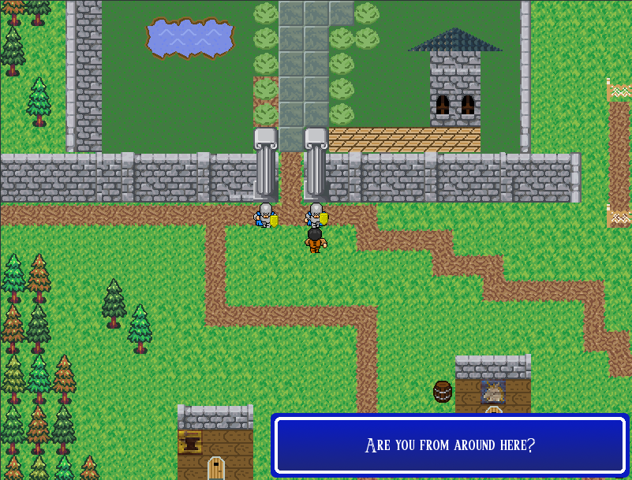

Harren RPG
==========

A fantasy mini-RPG built with Python and Pygame.

Requirements: ``Python3``, ``Pygame>=1.9.1``

For Linux developers, the project bundles a Makefile - the following commands
may prove useful:

- ``make run`` Launch the game
- ``make run-debug`` Launch the game in with debug logging
- ``make env`` Builds the virtual environment for the game to run in
- ``make clean`` Cleanup cache files and other artifacts
